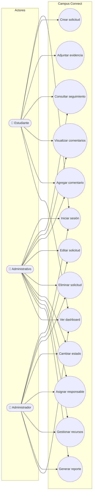
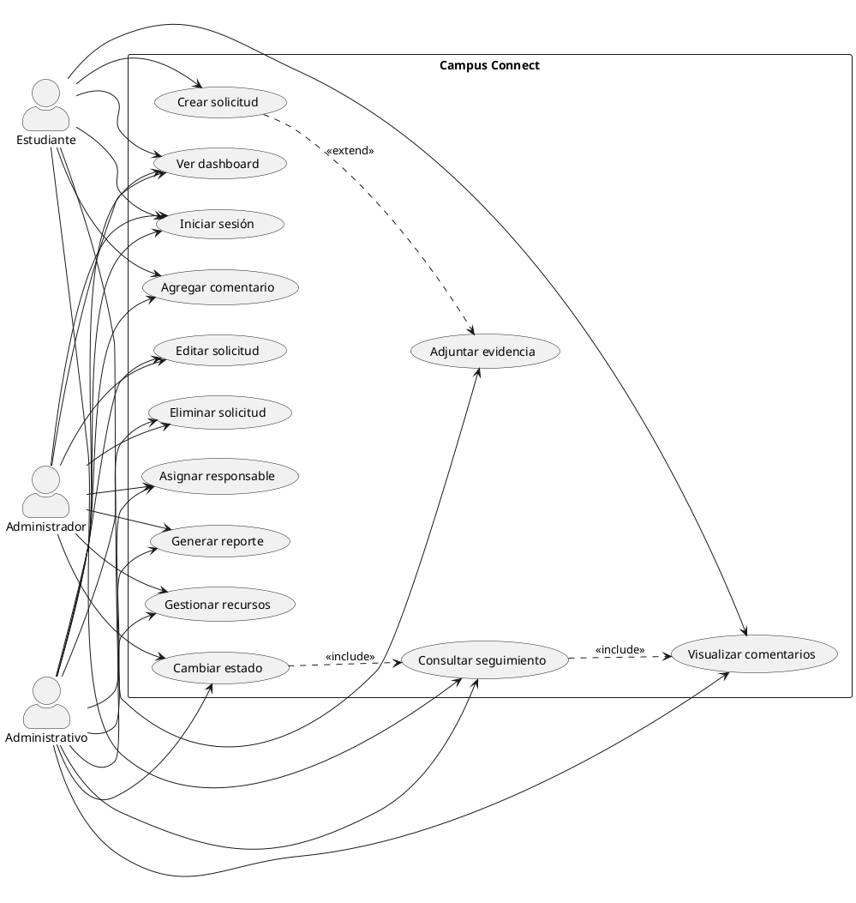
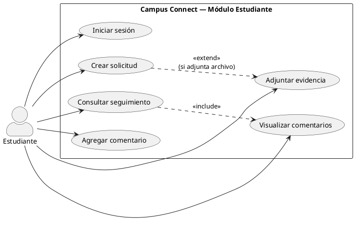
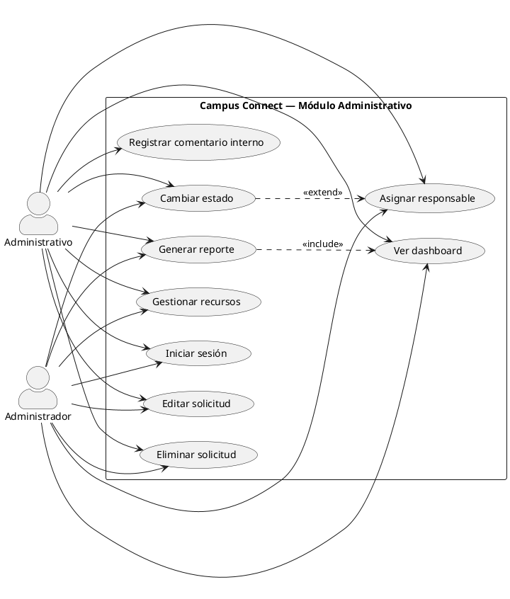

# Diagramas de casos de uso — Campus Connect

Los diagramas usan notación UML estándar:
- **Actor** = figura de persona (stickman) fuera del sistema.
- **Caso de uso** = óvalo dentro del límite del sistema.
- **Asociación** = línea actor ↔ caso de uso.
- **Include / Extend** = relaciones entre casos de uso.

> Archivos PlantUML listos para renderizar (recomendado para la entrega):
> - `docs/diagramas/casos-de-uso-general.puml`
> - `docs/diagramas/casos-de-uso-estudiante.puml`
> - `docs/diagramas/casos-de-uso-administrativo.puml`
>
> En VS Code/Cursor: extensión **PlantUML** + Java, o pegar en https://www.plantuml.com/plantuml/uml/

## Vista rápida (Mermaid — GitHub)

## 1. Diagrama general del sistema (PlantUML)

## 2. Casos de uso del estudiante (Web / Móvil)

## 3. Casos de uso administrativos (Web)

## 4. Especificación breve de actores

| Actor | Tipo | Descripción |
|-------|------|-------------|
| Estudiante | Primario | Persona usuaria que reporta y consulta solicitudes. |
| Administrativo | Primario | Personal que atiende, prioriza y da seguimiento. |
| Administrador | Primario | Supervisa operaciones, recursos y reportes. |

> Nota UML: el **actor** siempre se representa con el símbolo de personita (stickman). No se usa un rectángulo ni un caso de uso para representar personas. El **sistema** se delimita con un rectángulo que contiene solo los óvalos de casos de uso.
